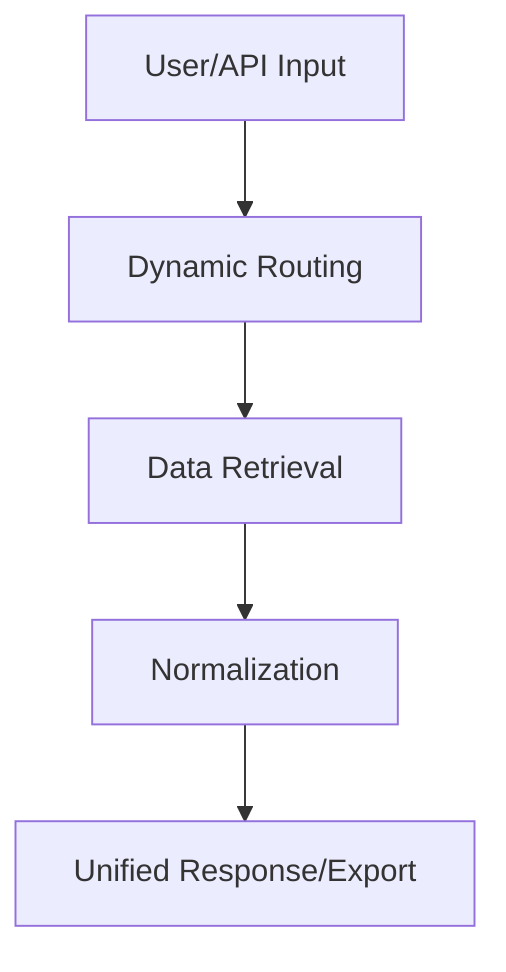

  

<h1 align="center">ClearView™ 🔎💡</h1>

<i>Setting the New Standard for Unified, Accessible Veterinary Licensee Data</i>

  
  
  
  

---

## ⚡ TL;DR

> **ClearView™** brings veterinary licensee data from multiple official jurisdictions into a **single, lightning-fast portal**.  
> - Not for credentialing—just organized, public records lookup.
> - **11 regions** and counting!
> - For HR, compliance, research, and developers.
> - [🎯 Give feedback, request a region, or suggest a feature »](https://github.com/BorDevTech/ClearView/issues/new?template=feedback-form.md)

---

## 🗂️ Table of Contents
- [🏛️ Platform Overview](#-platform-overview)
- [🎯 Target Markets & Use Cases](#-target-markets--use-cases)
- [🚀 Current Capabilities](#-current-capabilities-v010)
- [🔄 How It Works](#-how-it-works-system-flow)
- [💸 Business Model & Pricing](#-business-model--pricing)
- [🗺️ Roadmap & Ambition](#-roadmap--ambition)
- [📚 Documentation & Support](#-documentation--support)
- [🏗️ System Architecture & Development](#-system-architecture--development)
- [⚖️ Legal Notice](#-legal-notice)
- [❓ FAQ](#-faq)

---

## 🏛️ Platform Overview

>   **ClearView™** is a modular, extensible platform that aggregates, organizes, and presents veterinary licensee records across regions.  
Think of it as a digital library—each region is a “chapter,” every licensee an “entry.”

- 🔗 **Unified Access**: Modern UI for browsing/searching across all regions.
- 🔄 **Composable Pipeline**: Supports TXT, CSV, JSON, PDF, HTML, and API.
- 🔌 **Pluggable Jurisdictions**: Add new states/provinces in a snap.
- 🛠️ **Developer-Ready**: Robust REST API.
- 🛡️ **Security**: E2E encryption, role-based access.

> ℹ️ *ClearView™ does not issue, interpret, or validate credentials. For official matters, contact the relevant board.*

---

## 🎯 Target Markets & Use Cases

| 🏥 Clinics | 👔 HR/Compliance | 📊 Researchers | 🛡️ Regulators | 🛠️ Developers |
|---|---|---|---|---|
| New hire checks | Batch audits | Workforce studies | Data quality | Build integrations |
| Locum verification | Onboarding | Public health | Transparency | Custom dashboards |

**Other users:** Corporate vet groups, insurers, credentialing orgs, analytics platforms.

---

## 🚀 Current Capabilities (v0.1.0)

- **Supported Regions:**  
  - 🇺🇸 Alabama, Alaska, Arizona, Arkansas, Colorado, Connecticut, Florida, Missouri, New Mexico  
  - 🇨🇦 Alberta, British Columbia  
  *(11 and growing!)*

- **Key Features:**  
  - 🔍 Unified, multi-region search
  - 📦 Batch lookup & export
  - 📊 Downloadable audit data
  - ⚡ Fast, responsive UI & API

---

## 🔄 How It Works (System Flow)

1. **Select region** & enter search.
2. **Smart routing** to the right module.
3. **Automated data retrieval & harmonization.**
4. **Unified results for UI/API/export.**

> [🌐 Try it live!](https://clear-view-two.vercel.app/) | [🧪 Evaluation Demo](https://bordevtech.github.io/ClearView/)

---

## 💸 Business Model & Pricing

| Plan         | Features (summary)                              | Best for                     |
|--------------|------------------------------------------------|------------------------------|
| 🆓 Free      | Basic search, public lookup, sample API         | Individuals, students, small |
| 💼 Team      | Batch, reports, higher API limits, support      | HR, compliance, clinics      |
| 🏢 Enterprise| Custom integration, SLAs, white-label, volume   | Corporates, regulators       |
| 👩‍💻 Developer | API-first, pay-as-you-go or subscribe          | Integrators, platforms       |

> 📨 [Contact us](mailto:sales@bordevtech.com) for a custom quote or partnership.

---

## 🗺️ Roadmap & Ambition

- 🌍 **Expansion:** 50+ US states, Canada, global.
- 🔔 **Real-time data:** Live sync & alerts.
- 📈 **Features:** Bulk, webhooks, analytics, SSO.
- 📱 **Ecosystem:** Mobile, white-label, marketplace.

> [✨ Suggest a region or feature »](https://github.com/BorDevTech/ClearView/issues/new?template=feedback-form.md)

---

## 📚 Documentation & Support

- 📖 [Technical Docs](https://docs.clearview.bordevtech.com)
- 💻 [API Reference](https://api.clearview.bordevtech.com)
- 📨 sales@bordevtech.com | dev@bordevtech.com

---

## 🏗️ System Architecture & Development

- **Frontend:** Next.js, React, Tailwind, Chakra UI
- **Backend:** Node.js, Next.js API, custom parsers
- **CI/CD:** Vercel, automation, code quality
- **Modules:** Jurisdiction plug-ins for easy scaling

---

## ⚖️ Legal Notice

© 2025 BorDevTech LLC.  
ClearView™ does not issue, validate, or interpret credentials. Always consult official boards for legal status.

---

## ❓ FAQ

Is ClearView™ a credentialing service?

No, it only presents aggregated public license data. For legal credentialing, contact the official board.

Who should use ClearView™?

Anyone needing quick access to multi-region veterinary license records: HR, compliance, researchers, devs, orgs.

How do I request a new region or feature?

<a href="https://github.com/BorDevTech/ClearView/issues/new?template=feedback-form.md">Use our feedback form</a>.

---

<i>ClearView™ — The new standard for unified, accessible veterinary licensee data.</i>

